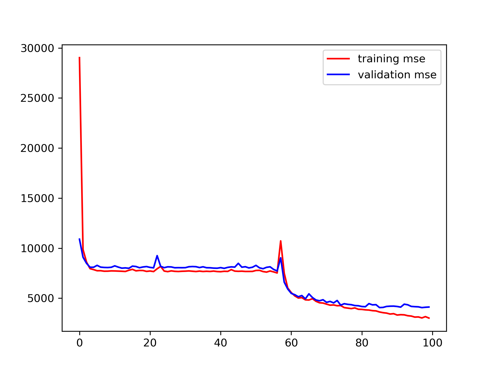

head pose estimation

- track facial landmarks from 2d image
- dataset : AFLW2000-3D dataset

- model 1 `model/my_model.h5`

    ```python
    model = Sequential()
    model.add(Convolution2D(16, (5,5), activation='relu', input_shape=(450,450,3), padding='same'))
    model.add(MaxPooling2D(pool_size=(10,10)))
    model.add(Convolution2D(32, (5,5), activation='relu'))
    model.add(Convolution2D(64, (5,5), activation='relu'))
    model.add(Flatten())
    model.add(Dense(512))
    model.add(Dense(42))
    ```

- model 2 `model\1586751930.txt`

    get 500 data from dataset

    model architecture : same with model 1

    ```
    Model: "sequential"
    _________________________________________________________________
    Layer (type)                 Output Shape              Param #   
    =================================================================
    conv2d (Conv2D)              (None, 450, 450, 16)      1216      
    _________________________________________________________________
    max_pooling2d (MaxPooling2D) (None, 45, 45, 16)        0         
    _________________________________________________________________
    conv2d_1 (Conv2D)            (None, 41, 41, 32)        12832     
    _________________________________________________________________
    conv2d_2 (Conv2D)            (None, 37, 37, 64)        51264     
    _________________________________________________________________
    flatten (Flatten)            (None, 87616)             0         
    _________________________________________________________________
    dense (Dense)                (None, 512)               44859904  
    _________________________________________________________________
    dense_1 (Dense)              (None, 42)                21546     
    =================================================================
    Total params: 44,946,762
    Trainable params: 44,946,762
    Non-trainable params: 0
    _________________________________________________________________

    ```

- model 3 `model\1586752331.txt`

    divide image data with 255.0

    ```
    Model: "sequential"
    _________________________________________________________________
    Layer (type)                 Output Shape              Param #   
    =================================================================
    conv2d (Conv2D)              (None, 450, 450, 16)      1216      
    _________________________________________________________________
    max_pooling2d (MaxPooling2D) (None, 45, 45, 16)        0         
    _________________________________________________________________
    conv2d_1 (Conv2D)            (None, 41, 41, 32)        12832     
    _________________________________________________________________
    conv2d_2 (Conv2D)            (None, 37, 37, 64)        51264     
    _________________________________________________________________
    flatten (Flatten)            (None, 87616)             0         
    _________________________________________________________________
    dense (Dense)                (None, 512)               44859904  
    _________________________________________________________________
    dense_1 (Dense)              (None, 42)                21546     
    =================================================================
    Total params: 44,946,762
    Trainable params: 44,946,762
    Non-trainable params: 0
    _________________________________________________________________

    ```

## 200414

`https://github.com/yinguobing/cnn-facial-landmark/` 의 모델을 참고하여 아키텍쳐 설계

### Architecture

```
Model: "sequential"
_________________________________________________________________
Layer (type)                 Output Shape              Param #   
=================================================================
conv2d (Conv2D)              (None, 128, 128, 32)      896       
_________________________________________________________________
max_pooling2d (MaxPooling2D) (None, 64, 64, 32)        0         
_________________________________________________________________
conv2d_1 (Conv2D)            (None, 62, 62, 64)        18496     
_________________________________________________________________
conv2d_2 (Conv2D)            (None, 60, 60, 64)        36928     
_________________________________________________________________
max_pooling2d_1 (MaxPooling2 (None, 30, 30, 64)        0         
_________________________________________________________________
conv2d_3 (Conv2D)            (None, 28, 28, 64)        36928     
_________________________________________________________________
conv2d_4 (Conv2D)            (None, 26, 26, 64)        36928     
_________________________________________________________________
max_pooling2d_2 (MaxPooling2 (None, 13, 13, 64)        0         
_________________________________________________________________
conv2d_5 (Conv2D)            (None, 11, 11, 128)       73856     
_________________________________________________________________
conv2d_6 (Conv2D)            (None, 9, 9, 128)         147584    
_________________________________________________________________
max_pooling2d_3 (MaxPooling2 (None, 4, 4, 128)         0         
_________________________________________________________________
conv2d_7 (Conv2D)            (None, 2, 2, 256)         295168    
_________________________________________________________________
flatten (Flatten)            (None, 1024)              0         
_________________________________________________________________
dense (Dense)                (None, 1024)              1049600   
_________________________________________________________________
dense_1 (Dense)              (None, 42)                43050     
=================================================================
Total params: 1,739,434
Trainable params: 1,739,434
Non-trainable params: 0
_________________________________________________________________

```

- try 01


*train history graph*

epoch 100, batch size 64
no other hyperparameter tuning


- try 02


epoch 1000, batch size 16

-> overfitting